## Mermaid

Мармауд - это довольно упрощённый и далёкий аналог uml - спец. язык описания блок-схем, графиков и диаграмм с их визуализацией.

Блок схемы

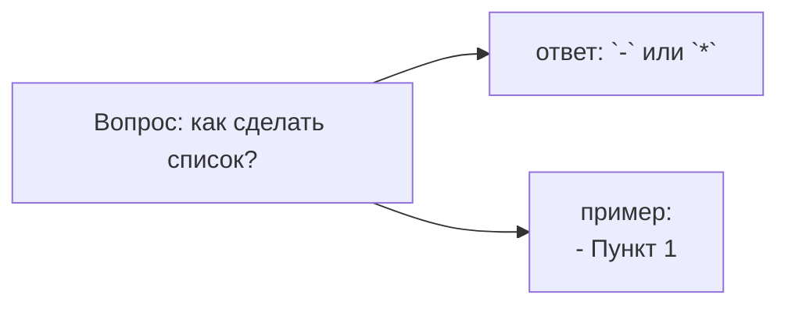

* `Flowchart` - блок-схема
* `LR` - направление вправо
* `А[],В[],С[]` - прямоугольник
* `-->` - стрелка связи
самостоятельно
### Круговая Диаграмма
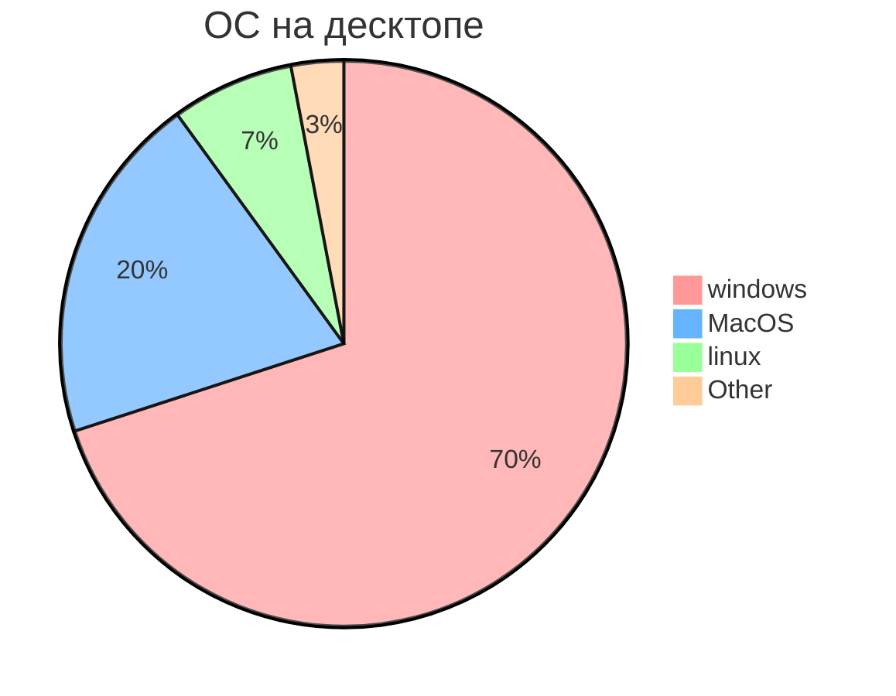
#### Базовая структура 2

## полный синтаксис блок-схем

### Диаграмма последовательности
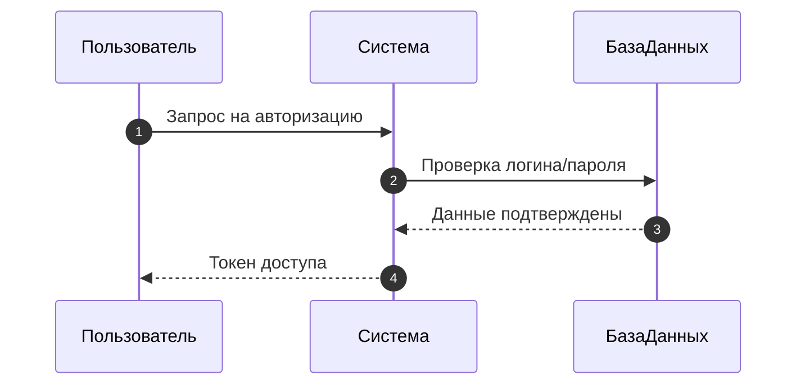

### Диаграмма класса
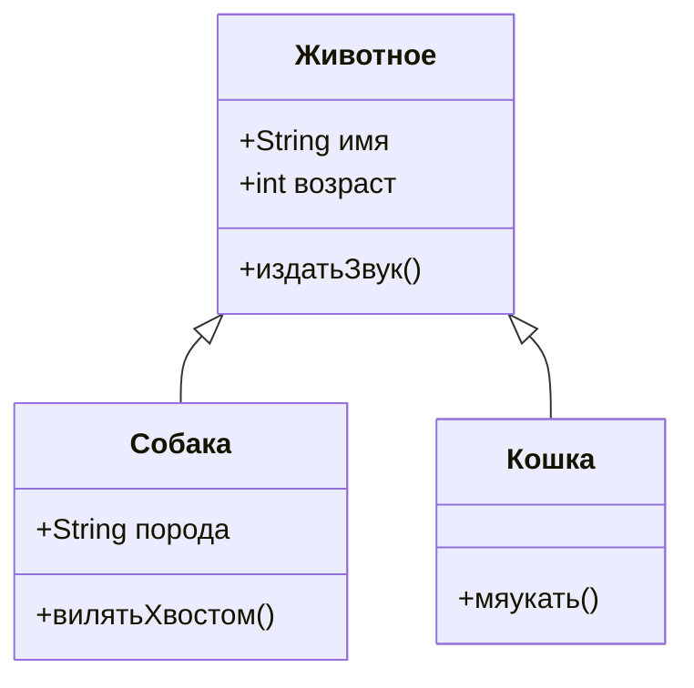

### Диаграмма Ганта
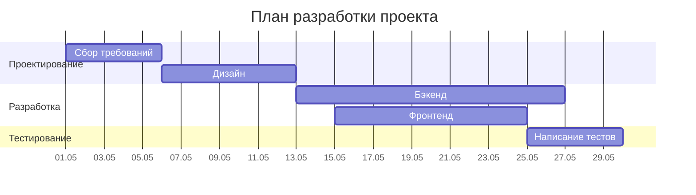
### Граф зависимостей
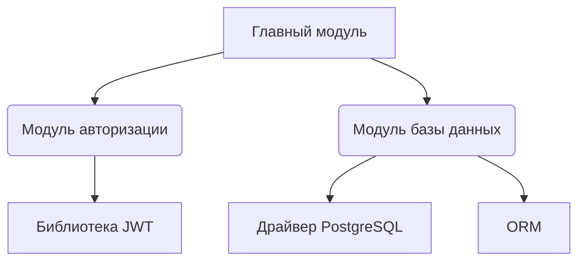
### Диаграмма состояний
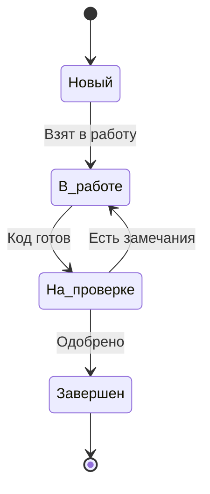
### Юзер-джайрни
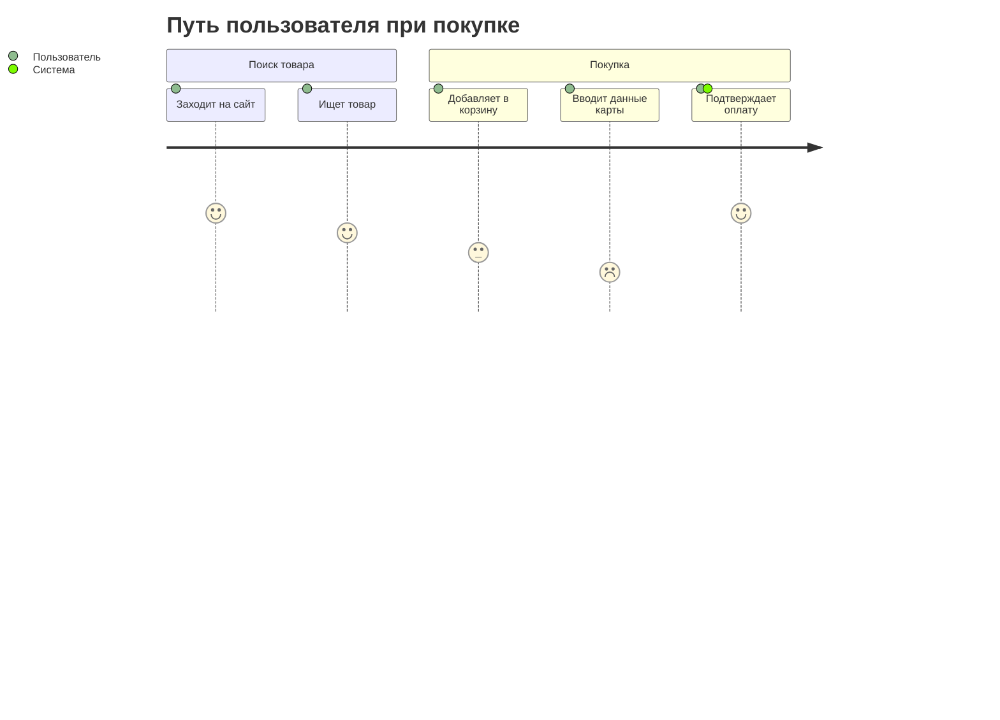
### Кастомизация стилей
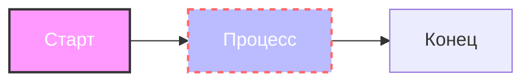
#### Классы CSS
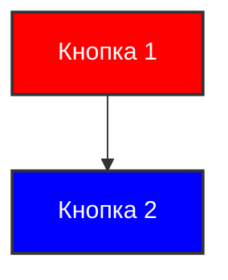
#### Интерактивность
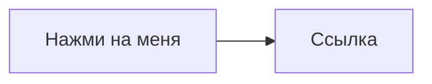
#
[Круговая-Диаграмма](#круговая-диаграмма)
