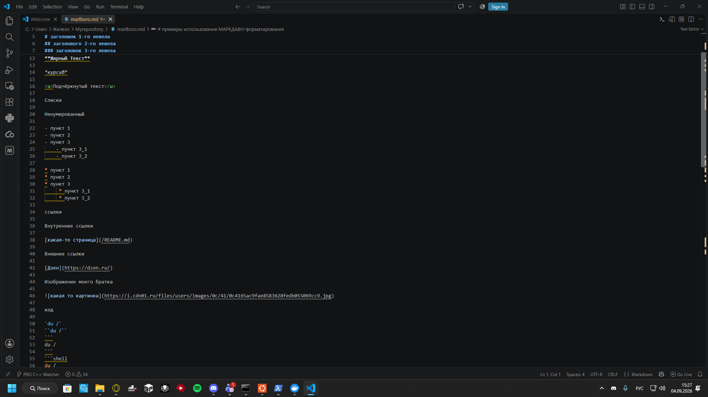
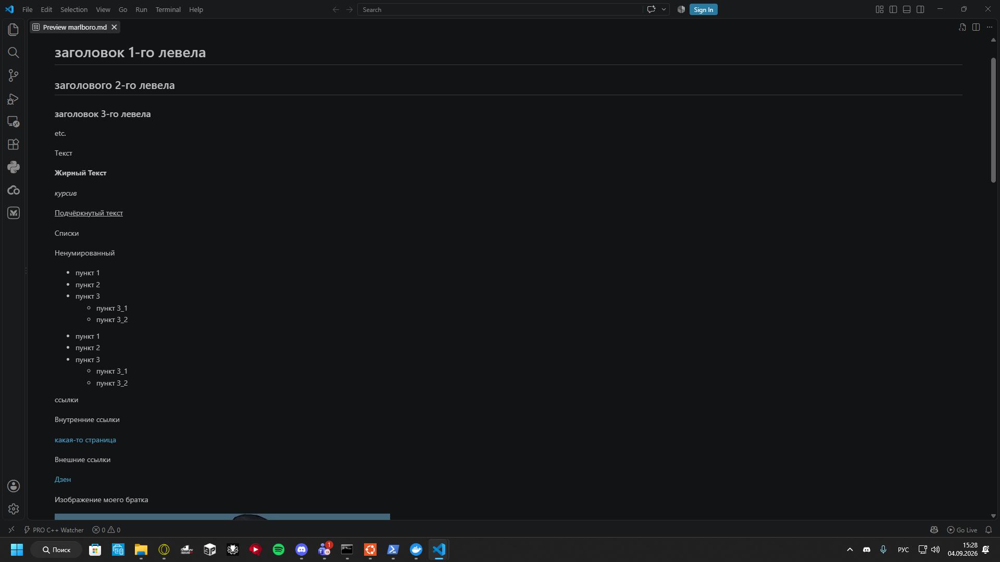

# Myrepository
# мой первый репозиторий

## здесь будет всё, что мы будем создавать с помощью кода
например первые заголовки тоже сделаны с помощью markdown кода

# О себе

ЙОУ меня зовут СЛОФЯН и я начинаю кодить на гитхаб свои проекты.
начинаю кодить с 17 под руководством преподавателя.

[самый первый мой проект](/marlboro.md)

## это я если у меня ниче не молучается:

##
```
- мои знания кода - ммм-эээ print(hello, world!).
- проекты будут по немногу дополняться новыми файлами и кодом.
- новые файлы будут появляться ТОЛЬКО на этом репозитории
- если вы видите у меня другой репозиторий, то это уже мой личный проект.
```

# Лицензии
пока что нет...
#

# Проекты
[первый](/marlboro.md)
#
# Скриншоты моего первого проекта



#


[Начало](#myrepository)

[Шутка](#это-я-если-у-меня-ниче-не-молучается)

[Лицензии](#лицензии)

[Проекты](#проекты)

[Скриншоты](#скриншоты-моего-первого-проекта)

[Discord (dead)](https://discord.gg/emJQTQq8eQ)